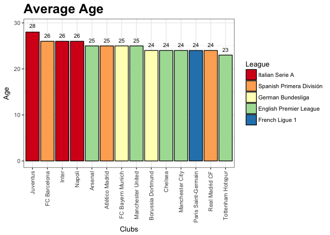
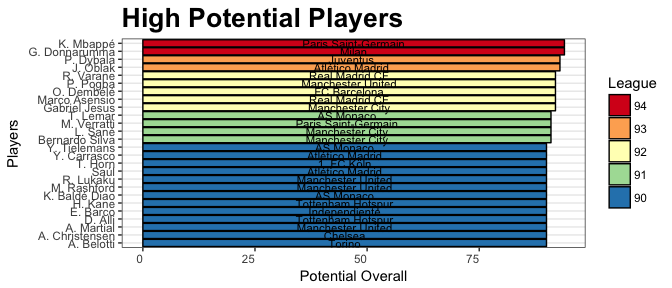
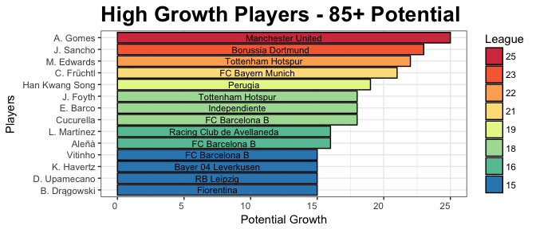

EDA of Fifa-18 dataset
================

Load libraries
--------------

``` r
library(feather)
library(tidyverse)
library(forcats)
```

Data Wrangling
--------------

``` r
path <- "complete.feather"
data <- read_feather(path)

data <- as.tibble(data)

basic <- data %>% select("name", "club","age", "league", "height_cm", "weight_kg","eur_value", "eur_wage", "eur_release_clause", "overall", "potential", "international_reputation", "preferred_foot", "skill_moves", "weak_foot", "strength", "stamina")

basic$league <- as.factor(basic$league)
basic$club <- as.factor(basic$club)

leagues <- c("Spanish Primera División","English Premier League","French Ligue 1", "German Bundesliga", "Italian Serie A")

star <- basic %>% filter(overall > 85) %>% group_by(club) %>% summarise(count = n()) %>% filter(count > 1) %>% droplevels()

clubs <- levels(star$club)

club_data <- basic %>% filter(club %in% clubs) %>% group_by(league,club) %>% summarise(count = n(),mean_overall = round(mean(overall)), mean_age = round(mean(age)), mean_potential = round(mean(potential)), total_cost = round(sum(eur_value)), total_wage = round(sum(eur_wage)))
```

EDA Graphs
==========

``` r
#Average Overall
club_data %>% ggplot(aes(fct_reorder(club,mean_overall, .desc = T), mean_overall, label = mean_overall)) + 
  geom_bar(aes(fill = fct_reorder(league, mean_overall, .desc = T)),color = "black", stat = "identity") + theme_bw() +
  theme(axis.text.x=element_text(angle=90,hjust=1,vjust=0.5), plot.title=element_text(size=20, face="bold"))+
  geom_text(size = 3, position = position_stack(vjust=1.05)) +
  labs(title = "Average Overall Ratings", y = "Overall" , x = "Clubs", fill = "League") +
  scale_fill_brewer(palette = "Spectral")
```


``` r
#Average Age
club_data %>% ggplot(aes(fct_reorder(club,mean_age, .desc = T), mean_age, label = mean_age)) + 
  geom_bar(aes(fill = fct_reorder(league, mean_age, .desc = T)),color = "black", stat = "identity") + theme_bw() +
  theme(axis.text.x=element_text(angle=90,hjust=1,vjust=0.5), plot.title=element_text(size=20, face="bold"))+
  geom_text(size = 3, position = position_stack(vjust=1.05)) +
  labs(title = "Average Age", y = "Age" , x = "Clubs", fill = "League") +
  scale_fill_brewer(palette = "Spectral")
```



``` r
#Average Potential
club_data %>% ggplot(aes(fct_reorder(club,mean_potential, .desc = T), mean_potential, label = mean_potential)) + 
  geom_bar(aes(fill = fct_reorder(league, mean_potential, .desc = T)),color = "black", stat = "identity") + theme_bw() +
  theme(axis.text.x=element_text(angle=90,hjust=1,vjust=0.5), plot.title=element_text(size=20, face="bold"))+
  geom_text(size = 3, position = position_stack(vjust=1.05)) +
  labs(title = "Average Potential", y = "Potential" , x = "Clubs", fill = "League") +
  scale_fill_brewer(palette = "Spectral")
```


``` r
#Total Wages
club_data %>% ggplot(aes(fct_reorder(club,total_wage, .desc = T), total_wage, label = round(total_wage/1e6,2))) + 
  geom_bar(aes(fill = fct_reorder(league, total_wage, .desc = T)),color = "black", stat = "identity") + theme_bw() +
  theme(axis.text.x=element_text(angle=90,hjust=1,vjust=0.5), plot.title=element_text(size=20, face="bold"))+
  geom_text(size = 3, position = position_stack(vjust=1.15)) +
  labs(title = "Total Wage", y = "Total Wages in Millions " , x = "Clubs", fill = "League")  +
  scale_fill_brewer(palette = "Spectral")
```


``` r
#Total Cost
club_data %>% ggplot(aes(fct_reorder(club,total_cost, .desc = T), total_cost, label = round(total_cost/1e6))) + 
  geom_bar(aes(fill = fct_reorder(league, total_cost, .desc = T)),color = "black", stat = "identity") + theme_bw() + 
  theme(axis.text.x=element_text(angle=90,hjust=1,vjust=0.5), plot.title=element_text(size=20, face="bold"))+
  geom_text(size = 3, position = position_stack(vjust=1.08)) +
  labs(title = "Total Cost", y = "Total Cost in Millions" , x = "Clubs", fill = "League") +
  scale_fill_brewer(palette = "Spectral")
```


``` r
#Number of players above 80

g1 <- basic %>% filter(club %in% clubs, overall >= 80) %>% group_by(league,club) %>% summarise(count = n())

g1 %>% ggplot(aes(fct_reorder(club,count, .desc = T), count, label = count)) + 
  geom_bar(aes(fill = fct_reorder(league, count, .desc = T)),color = "black", stat = "identity") + theme_bw() + 
  theme(axis.text.x=element_text(angle=90,hjust=1,vjust=0.5), plot.title=element_text(size=20, face="bold"))+
  geom_text(size = 3, position = position_stack(vjust=1.08)) +
  labs(title = "Number of Players above 80", y = "Number of Players" , x = "Clubs", fill = "League") +
  scale_fill_brewer(palette = "Spectral")
```


``` r
#Number of players above 85

g2 <- basic %>% filter(club %in% clubs, overall >= 85) %>% group_by(league,club) %>% summarise(count = n())

g2 %>% ggplot(aes(fct_reorder(club,count, .desc = T), count, label = count)) + 
  geom_bar(aes(fill = fct_reorder(league, count, .desc = T)),color = "black", stat = "identity") + theme_bw() + 
  theme(axis.text.x=element_text(angle=90,hjust=1,vjust=0.5), plot.title=element_text(size=20, face="bold"))+
  geom_text(size = 3, position = position_stack(vjust=1.23)) +
  labs(title = "Number of Players above 85", y = "Number of Players" , x = "Clubs", fill = "League") +
  scale_fill_brewer(palette = "Spectral")
```


``` r
plus90 <- basic %>% filter(potential >= 90 , age < 25) %>% mutate(fact_pot = as.factor(potential))


plus90 %>% ggplot(aes(fct_reorder(name,potential), potential, label = club)) + 
  geom_bar(aes(fill = fct_reorder(fact_pot, potential, .desc = T)),color = "black", stat = "identity") +
  theme_bw() + 
  theme(axis.text.x=element_text(hjust=1,vjust=0.5), plot.title=element_text(size=20, face="bold"))+
  geom_text(size = 3, position = position_stack(vjust=0.5)) +
  labs(title = "High Potential Players", y = "Potential Overall" , x = "Players", fill = "League") +
  scale_fill_brewer(palette = "Spectral") + coord_flip()
```



``` r
#High growth players with potential higher than 80
growth <- basic %>% mutate(growth = potential - overall) %>% mutate(fact_growth = as.factor(growth)) %>% filter(growth >= 21 ,potential > 80, age < 25) 
# %>% select("name", "growth", "club" )

growth %>% ggplot(aes(fct_reorder(name,growth), growth, label = club)) + 
  geom_bar(aes(fill = fct_reorder(fact_growth, growth, .desc = T)),color = "black", stat = "identity") +
  theme_bw() + 
  theme(axis.text.x=element_text(hjust=1,vjust=0.5), plot.title=element_text(size=20, face="bold"))+
  geom_text(size = 3, position = position_stack(vjust=0.5)) +
  labs(title = "High Growth Players - 80+ Potential", y = "Potential Growth" , x = "Players", fill = "League") +
  scale_fill_brewer(palette = "Spectral") + coord_flip()
```


``` r
#High growth players with potential higher than 85
growth <- basic %>% mutate(growth = potential - overall) %>% mutate(fact_growth = as.factor(growth)) %>% filter(growth >= 15 ,potential > 85, age < 25) 
# %>% select("name", "growth", "club" )

growth %>% ggplot(aes(fct_reorder(name,growth), growth, label = club)) + 
  geom_bar(aes(fill = fct_reorder(fact_growth, growth, .desc = T)),color = "black", stat = "identity") +
  theme_bw() + 
  theme(axis.text.x=element_text(hjust=1,vjust=0.5), plot.title=element_text(size=20, face="bold"))+
  geom_text(size = 3, position = position_stack(vjust=0.5)) +
  labs(title = "High Growth Players - 85+ Potential", y = "Potential Growth" , x = "Players", fill = "League") +
  scale_fill_brewer(palette = "Spectral") + coord_flip()
```


